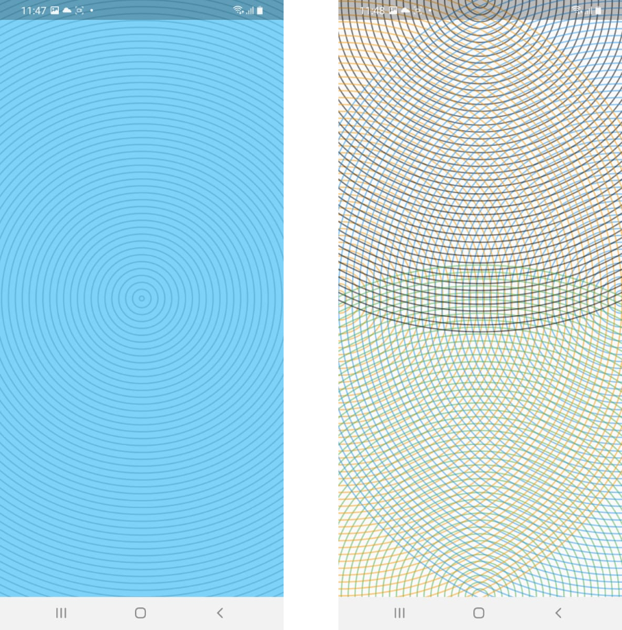
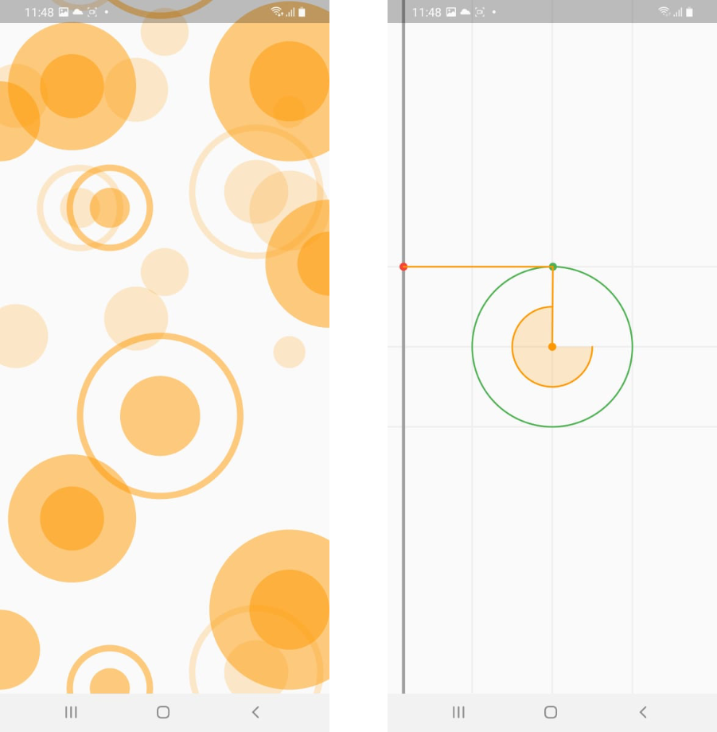

# Animations
 

 


## Introduction 

This is a practice repository, I'm learning about animations and custom painters on it, I will be continuously adding more animations, as long as I have time and want to practice something new

## Screens


<pre>

</pre>



## 👨🏻‍💻 Author
My name is Renato Montufar, I am a mobile developer, I love UI/UX and I am learning new things all the time. Feel free to contact me! 😀

- [LinkedIn](https://www.linkedin.com/in/deus-magna/)
- [GitHub](https://github.com/deus-magna/)
- [Twitter](https://twitter.com/deus_magna)
- [Instagram](https://www.instagram.com/deus_magna/) 

## 🤝 Contributing

Contributions, issues and feature requests are welcome!

## 🤔 Questions?
You can find me on [](https://twitter.com/burhanrashid52) [](https://www.instagram.com/deus_magna/) [](https://www.linkedin.com/in/deus-magna/)

## Show your support

Give a ⭐️ if this project helped you!

## Credits

- Flutter [**Documentation**](https://flutter.io/docs/)

## Getting Started

This project is a Flutter Application, you can use Visual Studio Code or Android Studio to build it.  
First download Flutter framework from [here](https://flutter.dev/docs/get-started/install).

Run this commands on your terminal

```sh
git clone https://github.com/deus-magna/animations
cd animations
flutter packages get
flutter run
```
For more info see [flutter doc](https://flutter.dev/docs) that contains examples, tutorials, gudes and more.